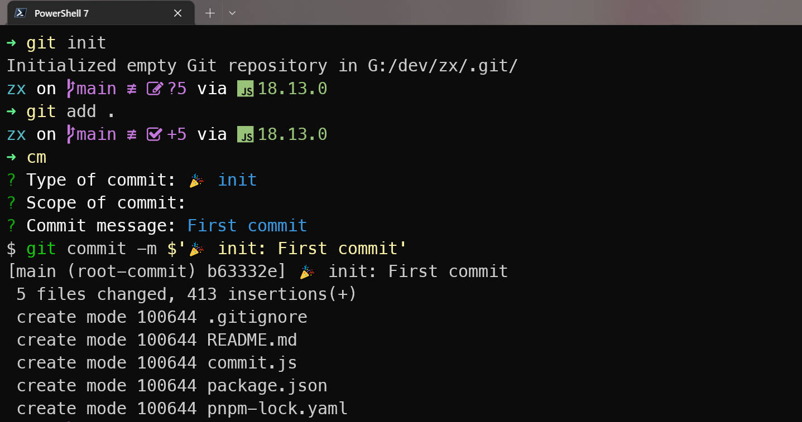
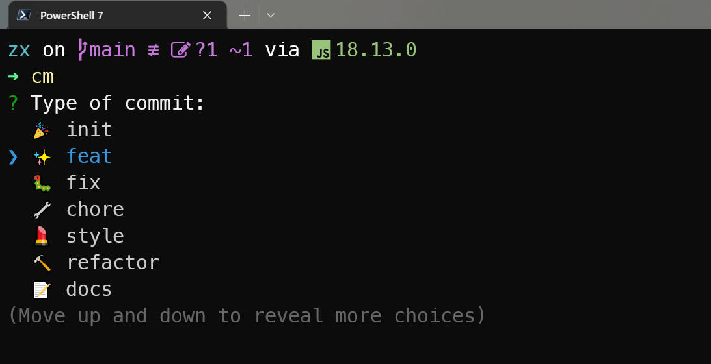

# zx script

Some scripts for daily use.

- commit.js: Quickly generate a git commit message template.



## Dev

- zx: https://github.com/google/zx
- inquirer: https://github.com/SBoudrias/Inquirer.js

## Use


Install
```bash
pnpm i
pnpm add zx -g
```

Run
```bash
zx commit.js
```

Then add the command to your environment variables. If you are using Powershell, you can add the code bellow to `Microsoft.PowerShell_profile.ps1`:
```bash
function cm {
  zx G:\dev\zx\commit.js
}
```

Here we go:

